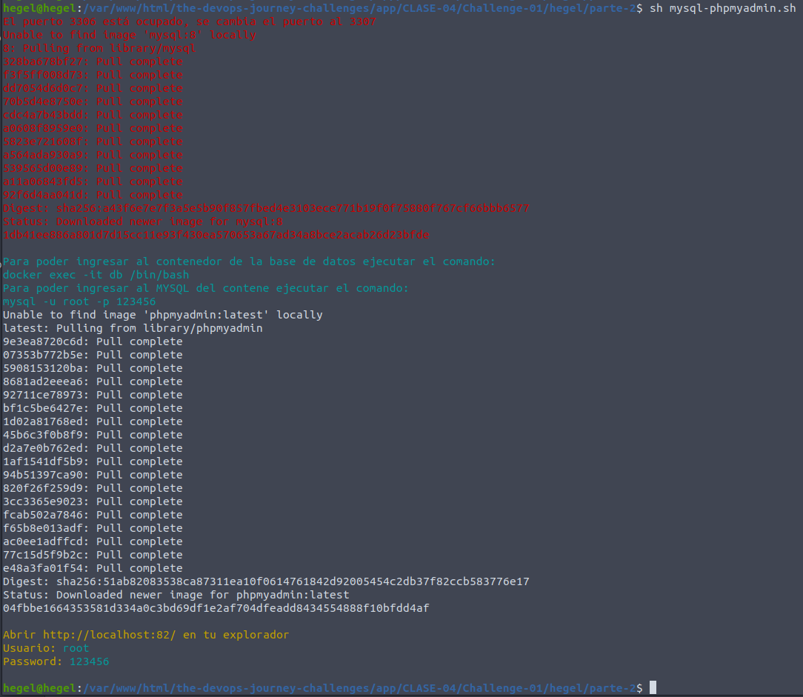
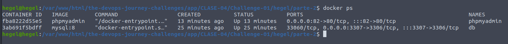
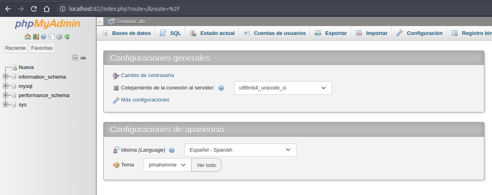
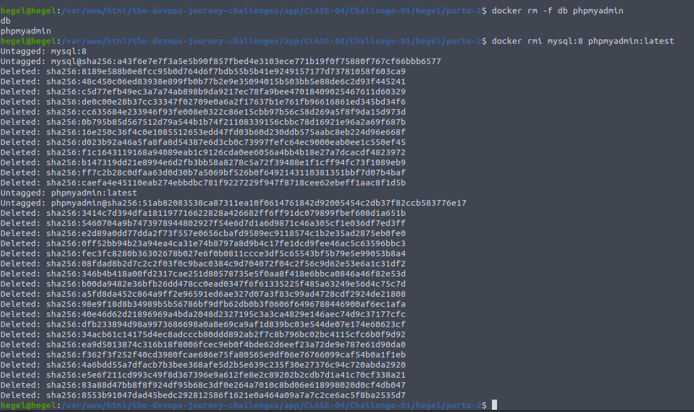

## Clase 4 - reto 1

* Se creo el archivo mysql-phpmyadmin.sh que contiene el paso a paso para la creacion de los contenedores de base de datos mysql y phpmyadmin.
* Se ejecuta el archivo mysql-phpmyadmin.sh para la descarga de imagenes y creacion de los contenedores

* Se ejecuta el comando `docker ps` para verificar que los contenedores se crearan correctamente.

* En el explorador abrimos la siguiente url `http://localhost:82/` ingresamos el usuario y contraseña

* Eliminamos los contenedores y las imagenes `docker rm -f db phpmyadmin` `docker rmi mysql:8 phpmyadmin:latest`.
