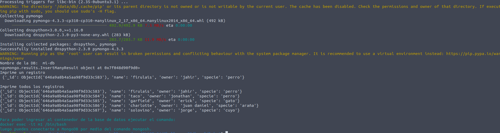
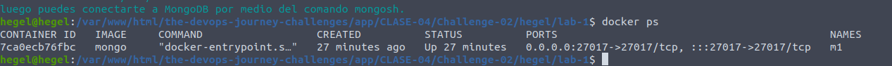
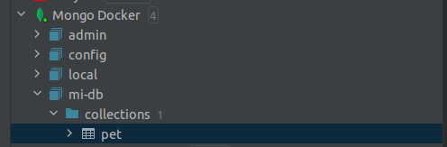
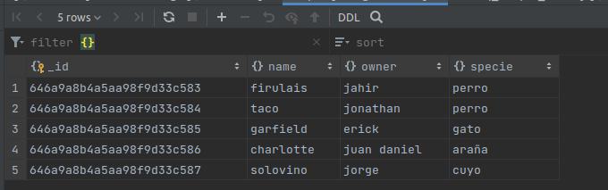
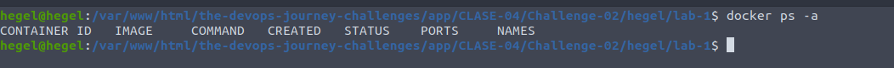

## Clase 4 - reto 2

* Se creo el archivo lab.sh que contiene el paso a paso para la creacion del contenedor de base de datos mongo.
* Se ejecuta el archivo lab.sh para la descarga de la imagen y creacion del contenedor

* Se ejecuta el comando `docker ps` para verificar que el contenedor se creara correctamente.

* En el cliente de base de datos verificamos que la base de datos y colleciones se crearan correctametne
 

* Eliminamos los contenedores y las imagenes `docker rm -f m1` `docker rmi mongo:latest`.
