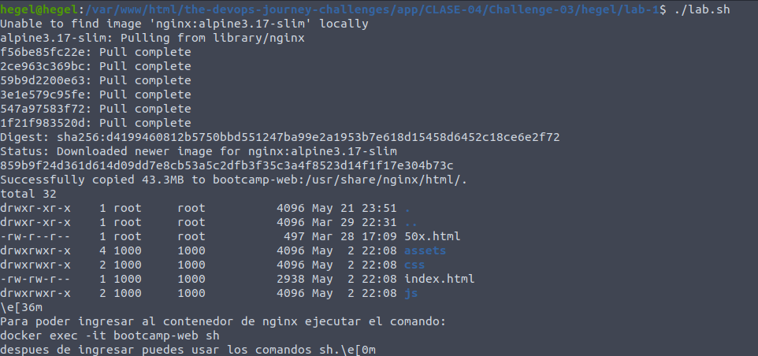
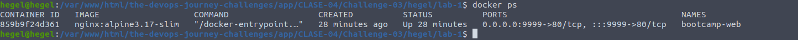
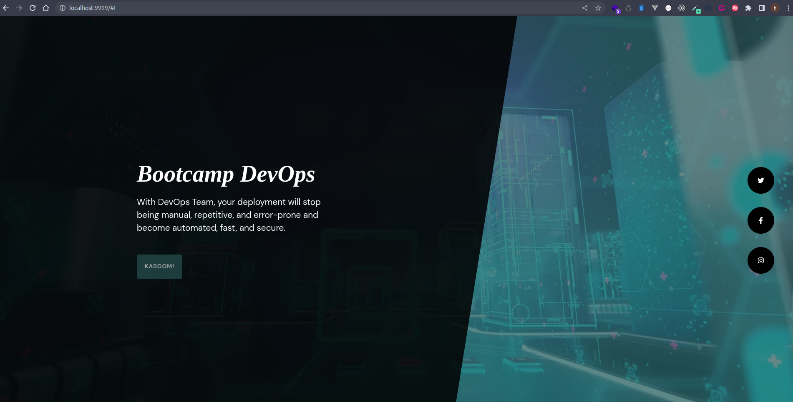
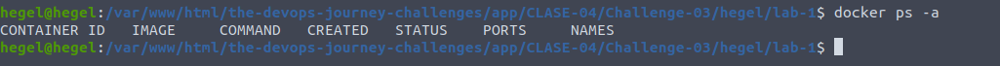

## Clase 4 - reto 3

* Se creo el archivo lab.sh que contiene el paso a paso para la creacion del contenedor de nginx.
* Se ejecuta el archivo lab.sh para la descarga de la imagen y creacion del contenedor

* Se ejecuta el comando `docker ps` para verificar que el contenedor se creara correctamente.

* En el browser ingresamos http://localhost:9999 para ver que se visualice la web correctamente

* Eliminamos los contenedores y las imagenes `docker rm -f bootcamp-web` `docker rmi nginx:alpine3.17-slim`.
