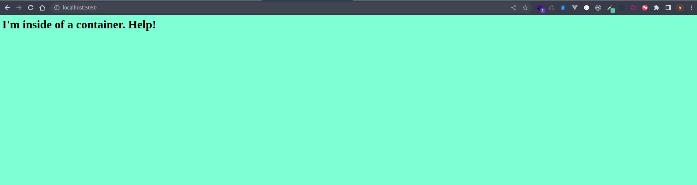

## Clase 4 - reto 4

* Se creo el archivo lab.sh que contiene el paso a paso para la creacion de la imagen y contenedor con base de nginx.
* Se ejecuta el archivo lab.sh para la descarga de la imagen base, crear la nueva imagen y creacion del contenedor

* Se ejecuta el comando `docker ps` para verificar que el contenedor se creara correctamente.

* En el browser ingresamos http://localhost:5050 para ver que se visualice la web correctamente

* Eliminamos el contenedor y la imagen `docker rm -f mynginx` `docker rmi simple-nginx`.
