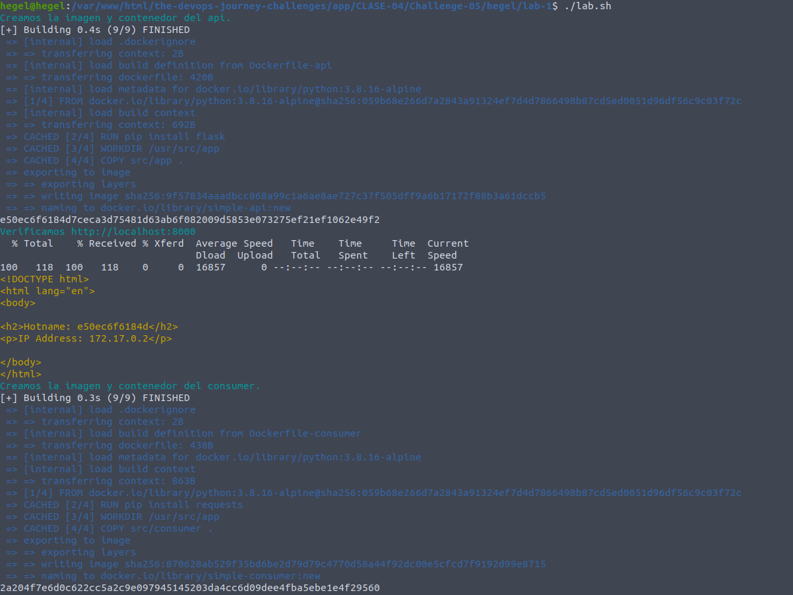
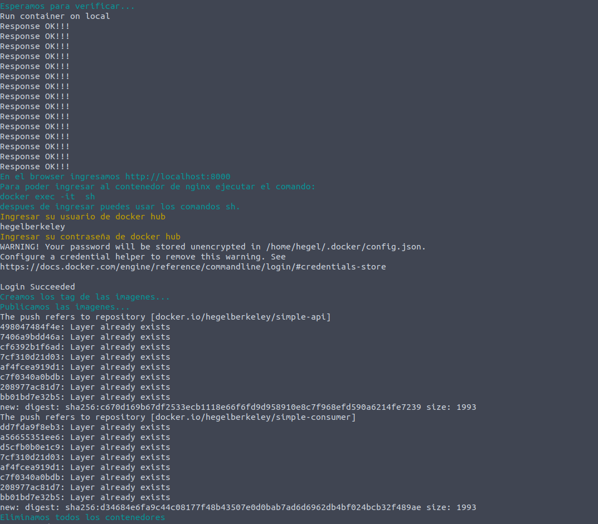
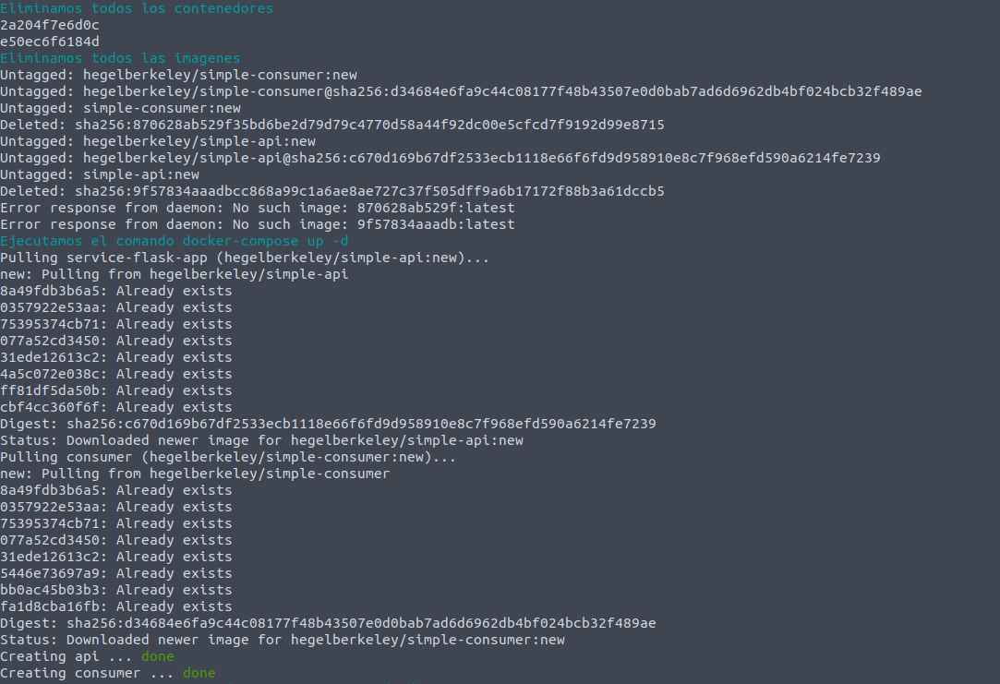
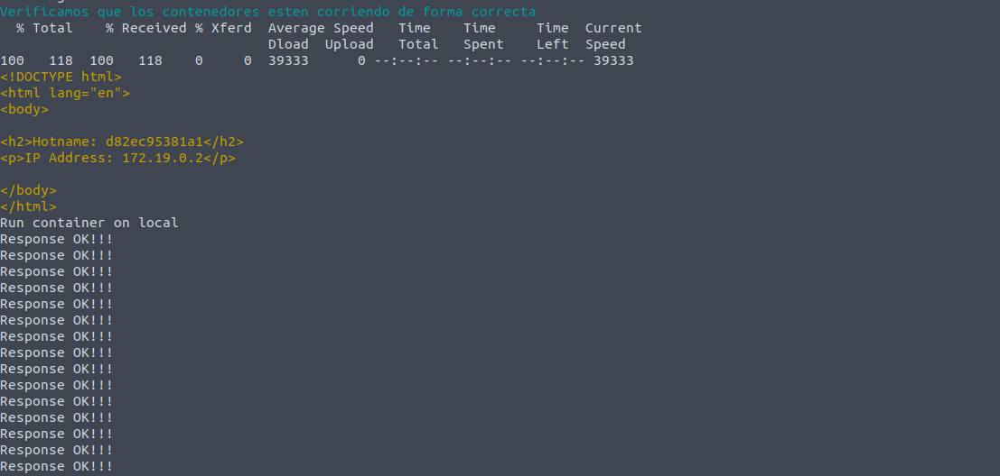
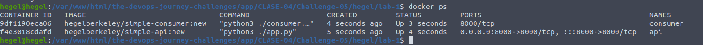
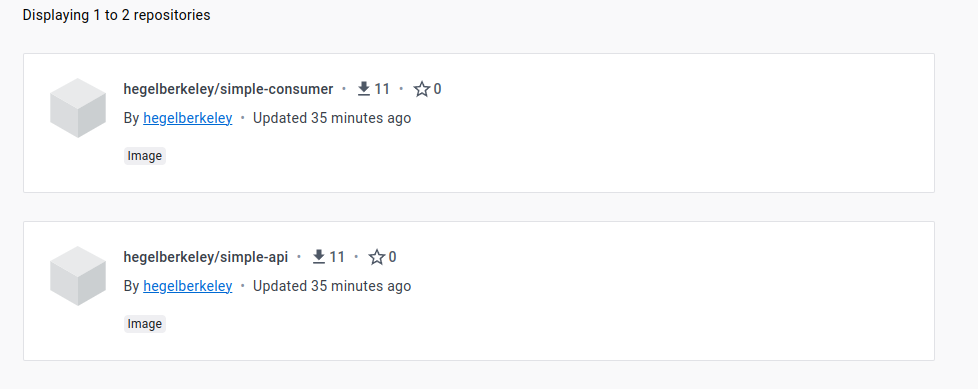
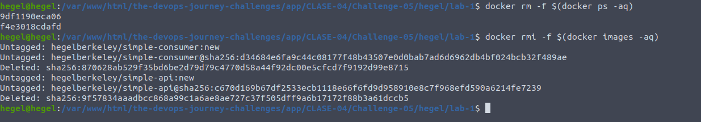

## Clase 4 - reto 5

* Se creo el archivo lab.sh que contiene el paso a paso para la creacion de la imagen, contenedor con base de python.
* Se ejecuta el archivo lab.sh para la descarga de la imagen base, crear la nueva imagen y creacion del contenedor creacion de los nuevos tag, login en docker hub, push de las nuevas images

* 

* Se ejecuta el comando `docker ps` para verificar que los contenedores se crearan con las nuevas imagenes.

* Nuevas imagenes en https://hub.docker.com/u/hegelberkeley

* Eliminamos el contenedor y la imagen `docker rm -f mynginx` `docker rmi simple-nginx`.
