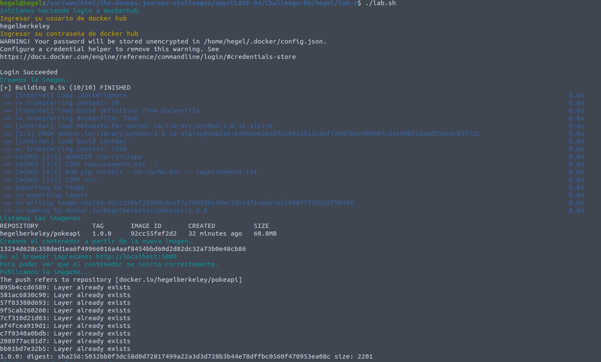
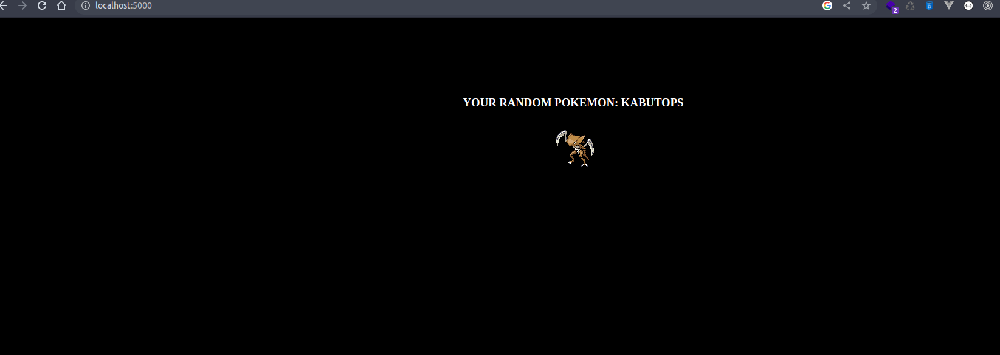
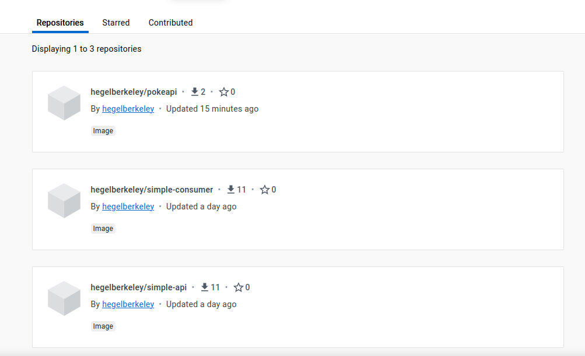
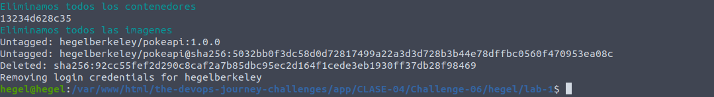

## Clase 4 - reto 6

* Se creo el archivo lab.sh que contiene el paso a paso para la creacion de la imagen, contenedor con base de python.
* Se ejecuta el archivo lab.sh para la creacion de la nueva imagen en base a un dockerfile, login y publicacion

* Ingersar en el browser la url http://localhost:5000.

* Nuevas imagenes en https://hub.docker.com/u/hegelberkeley

* Eliminamos el contenedor y la imagen `docker rm -f $(docker ps -aq)` `docker rmi -f $(docker images -aq)`.
  