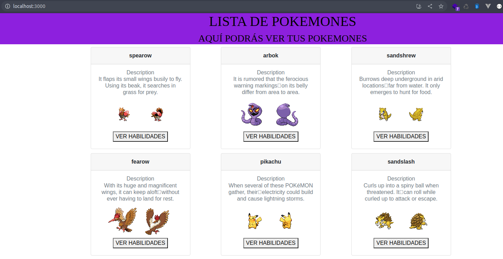

## Clase 4 - reto 7

* Se creo el archivo lab.sh que contiene el paso a paso para la creacion de los contenedores con base de python y node.
* Se ejecuta el archivo lab.sh para la descarga de la imagen base, crear la nueva imagen y creacion del contenedor creacion de los nuevos tag, login en docker hub, push de las nuevas images

* Nuevas imagenes publicadas en https://hub.docker.com/u/hegelberkeley

* Abrimos en el browser la api para verificar que este respondiendo `http://localhost:8000`.

* Abrimos en el browser la aplicacion web para verificar que este respondiendo `http://localhost:3000`.

