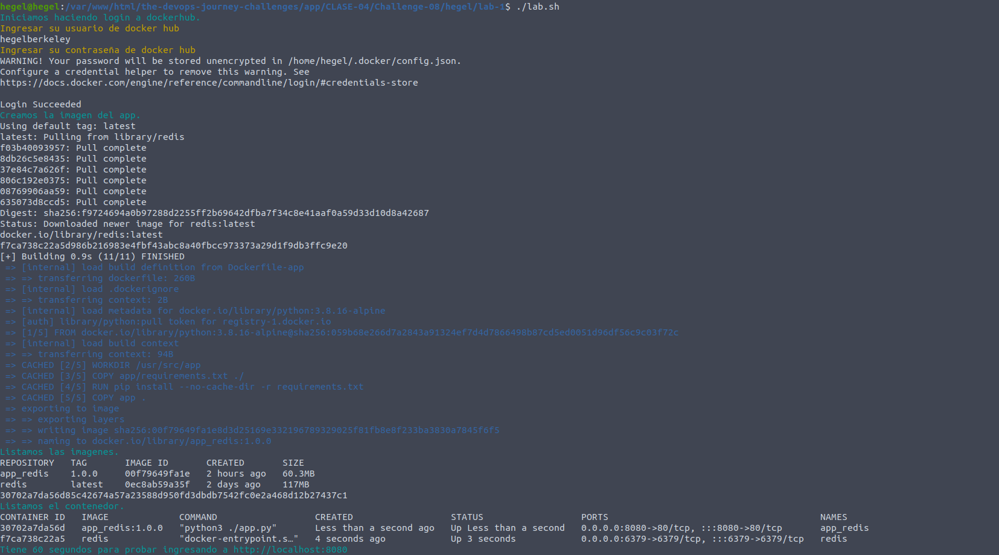
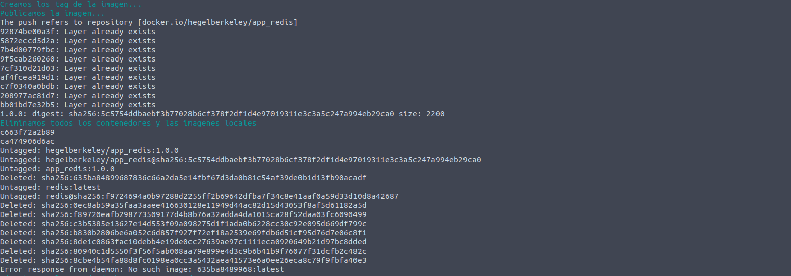
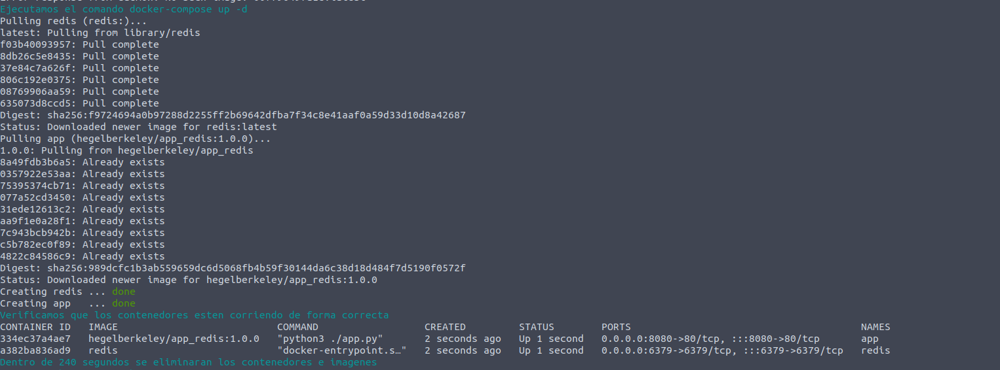
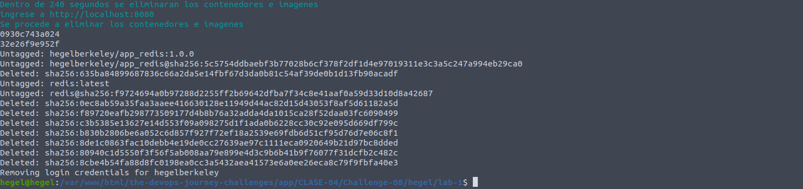
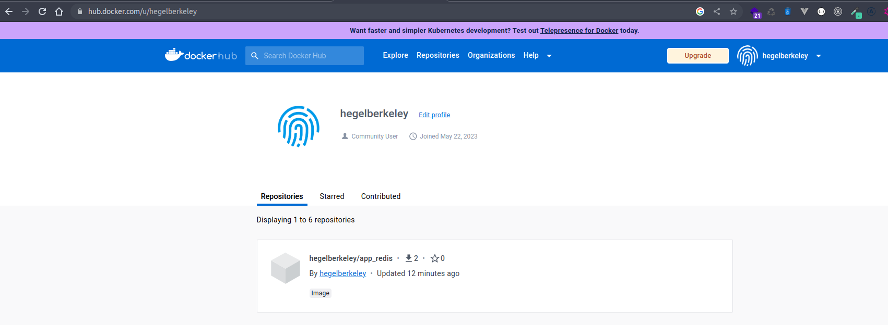
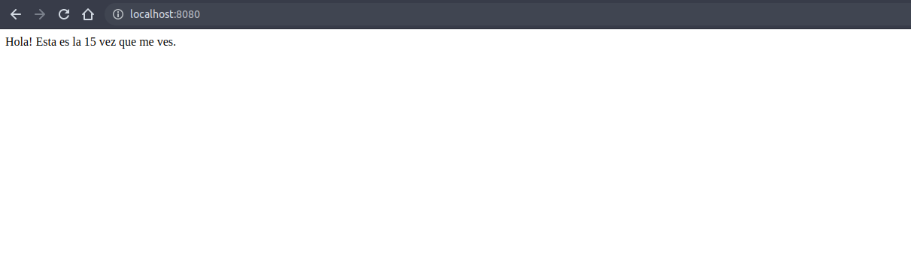

## Clase 4 - reto 8

* Se creo el archivo lab.sh que contiene el paso a paso para la creacion de los contenedores con base de python.
* Se ejecuta el archivo lab.sh para la descarga de la imagen base, crear la nueva imagen y creacion del contenedor creacion de los nuevos tag, login en docker hub, push de las nuevas images

* Nuevas imagenes publicadas en https://hub.docker.com/u/hegelberkeley

* Abrimos en el browser la app para verificar que este respondiendo `http://localhost:8080`.

