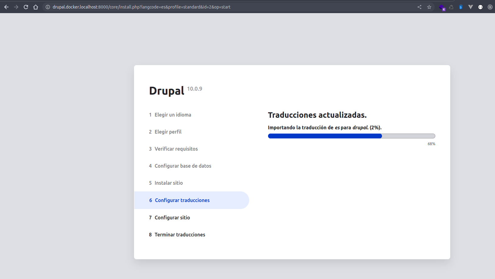
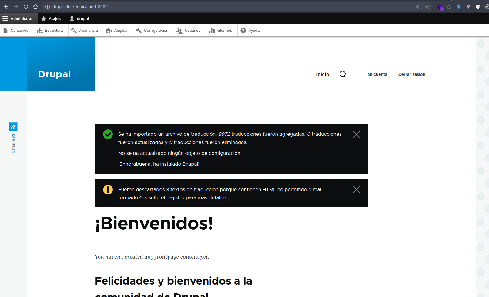

## Clase 4 - reto 9

* Se creo el archivo lab.sh que contiene el paso a paso para la creacion de los contenedores desde el repositorio.
* Se ejecuta el archivo lab.sh para clonar el repositorio y ejecutar el docker-compose.yml

* Abrimos en el browser la app para verificar que este respondiendo `http://drupal.docker.localhost:8000`.

