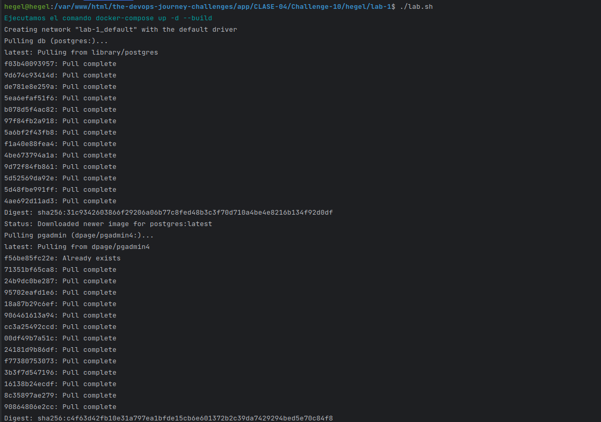
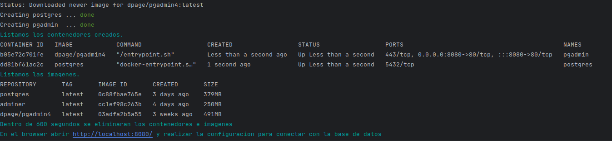
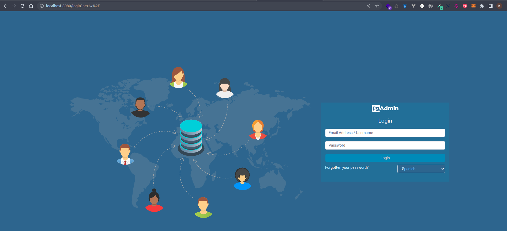
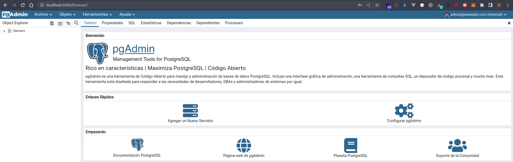
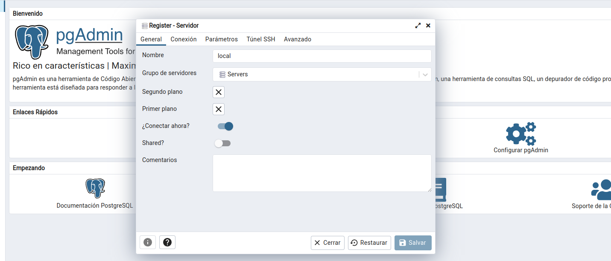
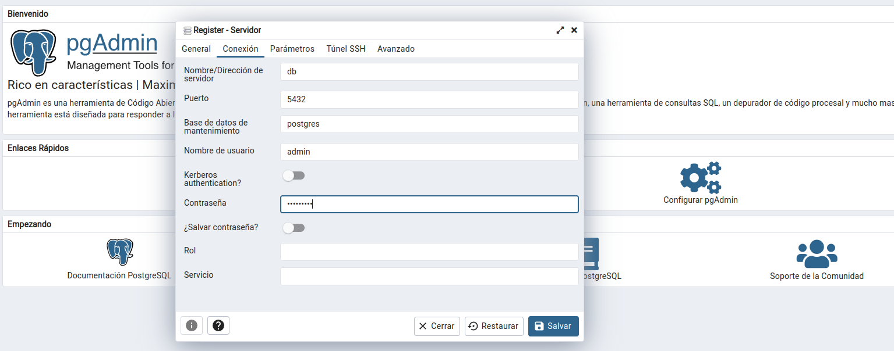
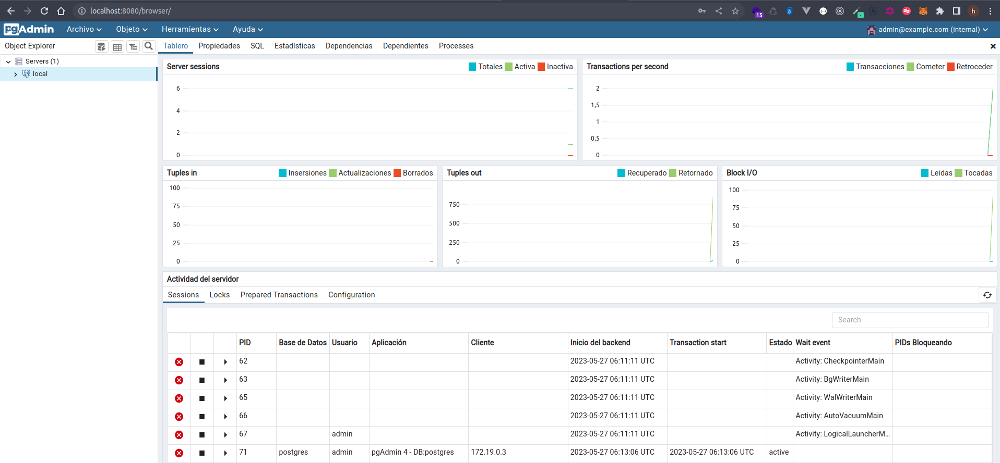
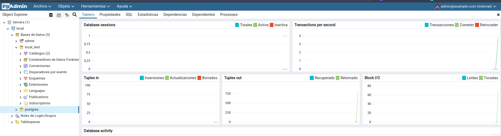

## Clase 4 - reto 10

* Se creo el archivo lab.sh que contiene el paso a paso para la creacion de los contenedores desde el repositorio.
* Se ejecuta el archivo lab.sh para ejecutar el docker-compose.yml

* Abrimos en el browser la app para verificar que este respondiendo `http://localhost:8080`.

