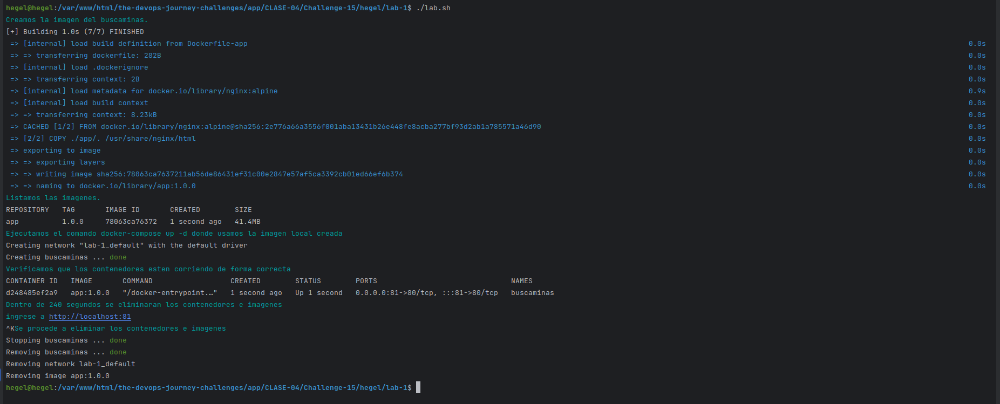

## Clase 4 - reto 15

* Se creo el archivo lab.sh que contiene el paso a paso para la creacion de la imagen en base a los dockerfile creados  y la ejecucion del docker-compose.yml
  

* Abrimos en el browser la app para verificar que este respondiendo `http://localhost:81` y a jugar.

